# Установка


## Установка R и RStudio

Перейдите по ссылке:  
[posit.co/download/rstudio-desktop](https://posit.co/download/rstudio-desktop)

В середине страницы найдите раздел **"Установка R и RStudio"**  
Нажмите **DOWNLOAD AND INSTALL R**

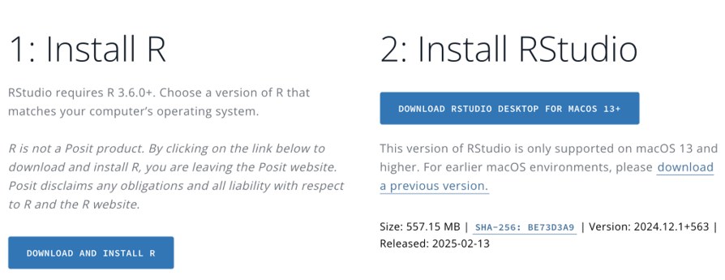{height="250px" width="650px"}

В открывшейся вкладке выберите из списка свою операционную систему

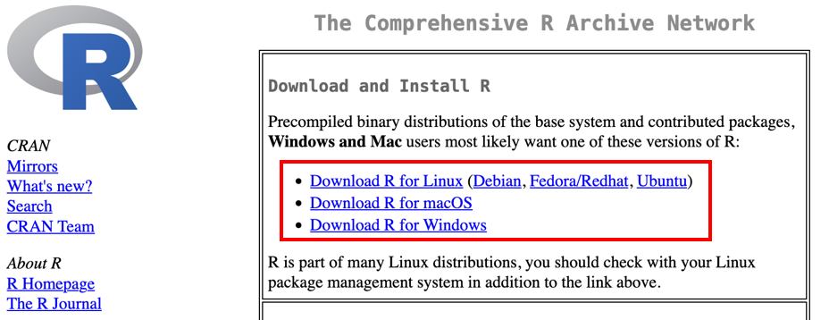{height="250px" width="650px"}

---

### Для Windows:

1. Выберите вариант **base**
2. Загрузите и установите `.exe` файл

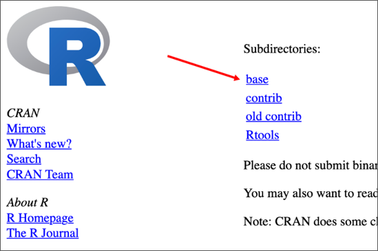{height="180px" width="270px"} 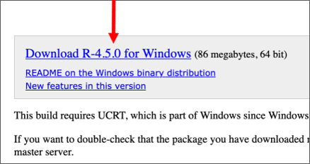{height="180px" width="339px"}

### Для Mac:

- Для новых Mac: загрузите и установите `.pkg` файл (верхний вариант)
- Для старых Mac: загрузите нижний `.pkg` файл

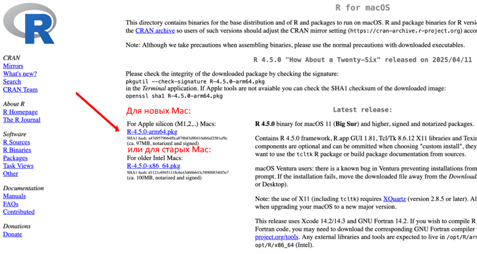{height="347px" width="650px"}

---

## Установка RStudio

1. Вернитесь или перейдите по ссылке:  
[posit.co/download/rstudio-desktop](https://posit.co/download/rstudio-desktop)
2. Нажмите **DOWNLOAD RSTUDIO DESKTOP**
3. Следуйте инструкциям установщика

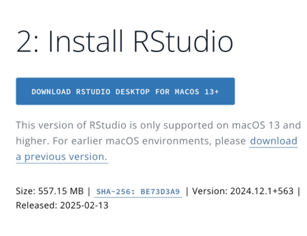{height="250px" width="325px"}

---

## Запуск RStudio

- Иконка **R** — запускает только консоль
- Иконка **RStudio** — запускает интерфейс (используем её)

{height="70px" width="200px"} {height="70px" width="86px"}

> Убедитесь, что установлена версия **R 4.2.x, 4.3.x, 4.4.x или 4.5.x**  
> Если версия другая — переустановите R по инструкции выше.

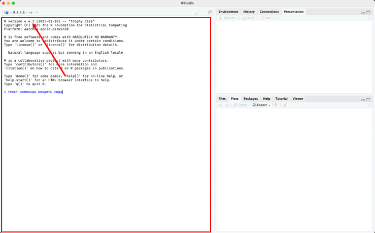{height="400px" width="650px"}

---

## Запуск команд в RStudio

Это — **консоль для ввода команд**.

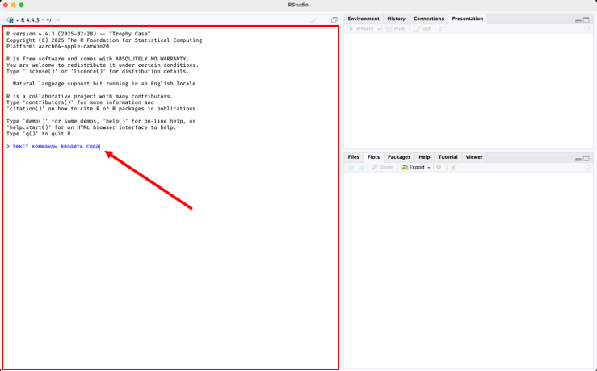{height="400px" width="650px"}

1. Введите текст команды  
2. Нажмите **Enter** для запуска

**Попробуйте:**

```r
summary(mtcars)
boxplot(mtcars$mpg)
```

Должен появиться график.

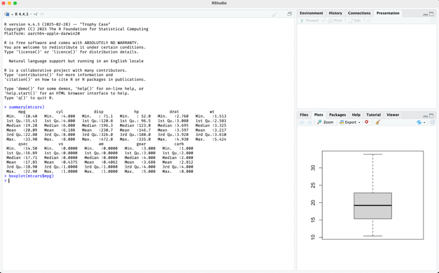{height="400px" width="650px"}

---

## Запуск файлов в RStudio

1. Скачайте и откройте файл `survival-demo.R`:  
   Верхнее меню → **File → Open File**
2. Выделите весь текст мышью  
3. Нажмите **Run**

Команды выполнятся в нижней консоли.

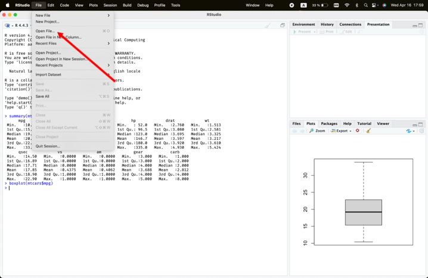{height="400px" width="650px"}
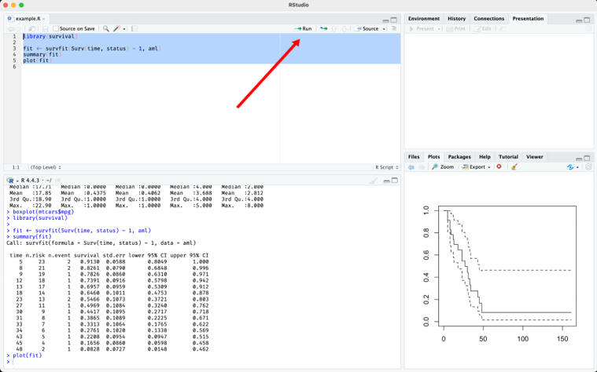{height="400px" width="650px"}

---

## Установка пакетов

> Пакеты могут устанавливаться долго — дождитесь окончания (например, до `tidyverse`)

В консоли введите:

```r
install.packages("tidyverse")
```

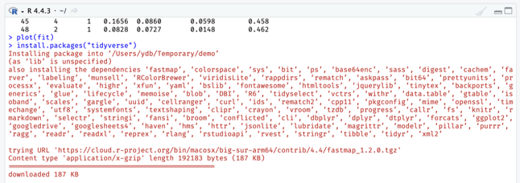{height="114px" width="323px"}

долго будут ставиться пакеты, пока не закончится на tidyverse

{height="60px" width="323px"}

---

## Демонстрация `tidyverse`

1. Скачайте и откройте файл `tidyverse-demo.R`:  
   Верхнее меню → **File → Open File**
   
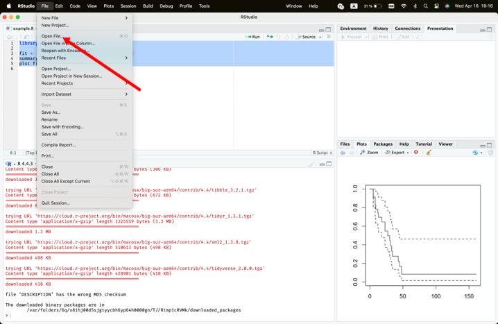{height="400px" width="650px"}
   
2. Выделите весь текст мышью  
3. Нажмите **Run**

Должен появиться **красивый график**.

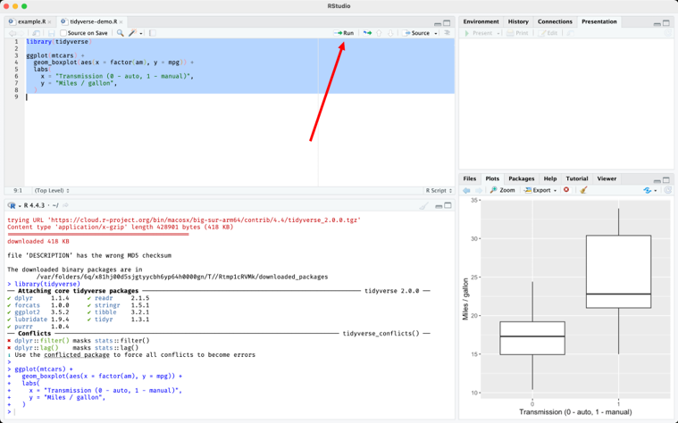{height="400px" width="650px"}
