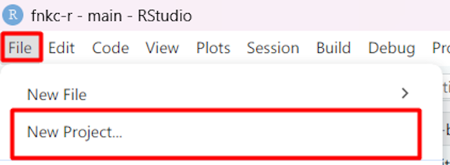

# Создание проекта

Меню проектов находится в правом верхнем углу интерфейса Rstudio.

Для создания нового проекта кликаем на меню.

Выбираем `New Project`.

Выбираем `New Directory`.

В следующем меню заполняем поле названия директории проекта и выбираем папку, в котором она будет располагаться кнопкой `Browse`.

После этого кликаем на кнопку `Create Project`, после чего проект будет создан и станет активен.

