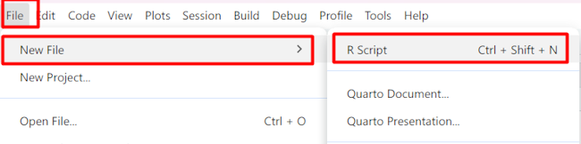
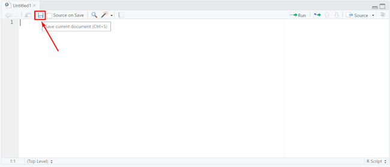
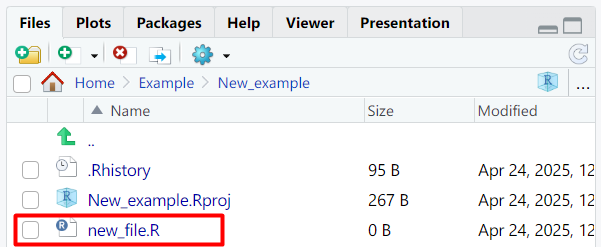

# Работа с проектами и файлами

Проект - это папка на компьютере, в которой запускается R. В ней должны находиться файлы с данными, скрипты для расчетов и результаты (графики и таблицы).

## Создание проекта

Для создания нового проекта в верхнем левом меню выберите `File` → `New Project`.

{height="120px" width="300px"}

В появившемся окне выберите `New Directory`. На следующем шаге `New Project`.
{height="234px" width="325px"}
{height="235px" width="325px"}

Введите название проекта (так же будет называться папка на компьютере). *Также можно указать где эта папка будет создана (кнопка `Browse`).*

{height="231px" width="325px"}

После этого кликаем на кнопку `Create Project` внизу. Проект будет создан и загружен. В окне обзора будут видны файлы этого проекта.

{height="273px" width="488px"}

## Открытие проекта

Теперь, если зайти в папку с проектом через проводник, можно найти файл проекта (на примере это `New_example.Rpoj`). Если дважды кликнуть по этому файлу, у вас откроется окно Rstudio с этим проектом.     

{height="250px" width="500px"}

## Создание и сохранение файла

Для создания нового файла выбираем меню `File` -> `New file` -> `R script`.
После этого открывается новый пустой файл.

{height="80px" width="325px"}

Чтобы сохранить файл (допустим, `new_file.R`), можно воспользоваться меню кнопкой сохранения в окне просмотра файла.Чтобы сохранить файл нажмите кнопку сохранения вверху окна. В появившемся диалоговом окне введите название файла и нажмите Save.

{height="190px" width="450px"}

В появившемся диалоговом окне вводим название файла в поле внизу и нажимаем `Save`.

{height="260px" width="410px"}

Теперь наш файл виден в окне просмотра `Rstudio`, при следующем сохранении менять имя файла не потребуется.

{height="124px" width="300px"}
