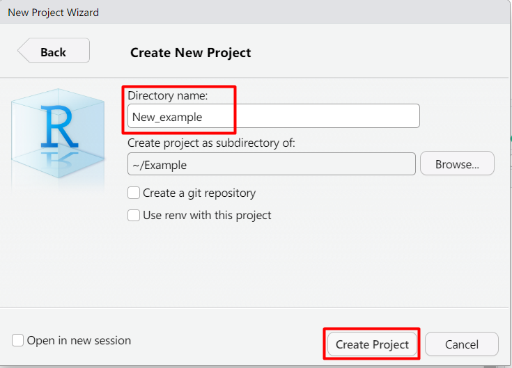
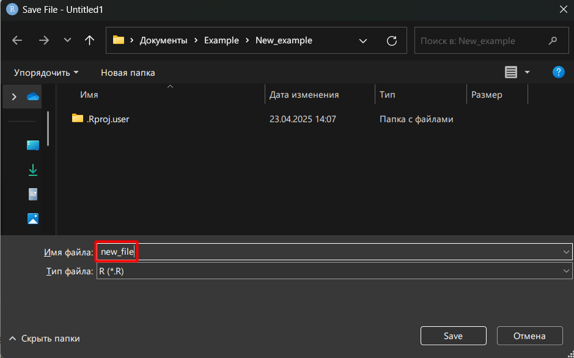

# Создание проекта

Меню проектов находится в меню `File` интерфейса Rstudio.

Для создания нового проекта кликаем на меню.

Выбираем `New Project`.

Выбираем `New Directory`.

В следующем меню заполняем поле названия директории проекта и выбираем папку, в котором она будет располагаться кнопкой `Browse`.

После этого кликаем на кнопку `Create Project`, после чего проект будет создан и станет активен.

## Сохранение файла

Если нам нужно сохранить файл (допустим, `New_file.R`), можно воспользоваться меню `File`.

В меню `File` ищем `Save` или `Save as`. В нашем случае мы создали новый файл, поэтому его нужно сохранить через кнопку `Save as`. В появившемся диалоговом окне выбираем папку для хранения нашего файла, вводим название в поле внизу и нажимаем `Save`.

Теперь наш файл виден в окне просмотра `Rstudio`, и при его изменении мы можем пользоваться кнопкой `Save` меню `File`.

